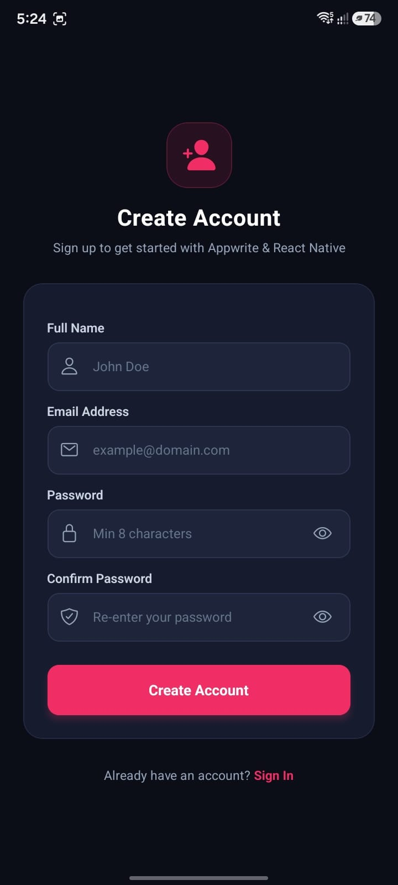
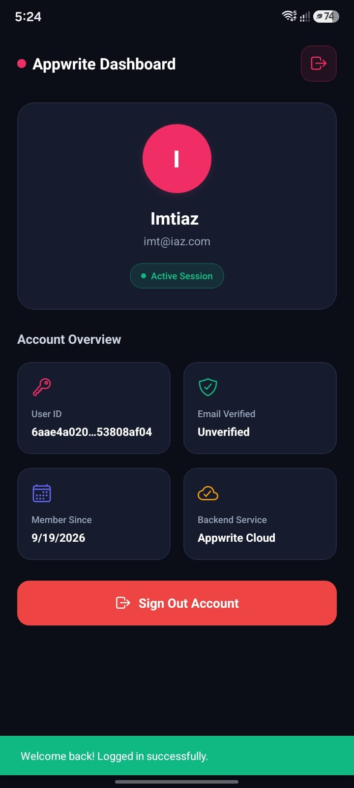
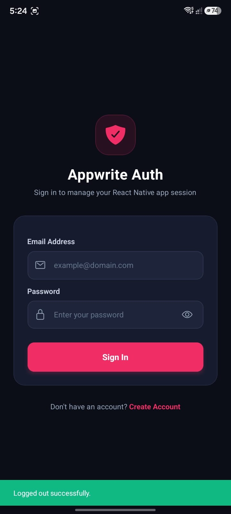

# 🚀 Appwrite Auth - React Native Mobile Application

[](https://reactnative.dev/)
[](https://appwrite.io/)
[](https://www.typescriptlang.org/)
[](LICENSE)

A production-ready, full-stack **React Native mobile authentication application** integrated with **Appwrite Backend as a Service (BaaS)**. Designed with a sleek modern dark theme, robust error handling, form validations, and clean state management.

---

## 📱 App Screenshots & Preview

| Login Screen | Sign Up Screen | Home Dashboard |
| :---: | :---: | :---: |
|  |  |  |

---

## ✨ Features

- **🔐 Appwrite Cloud Authentication**: Native integration with Appwrite Account & Session APIs.
- **⚡ Persistent Session Management**: Automatically restores session state on app launch.
- **🛡️ Secure Password Toggling**: Show/Hide password field toggle with custom icons.
- **🎨 Modern Dark Tech UI**: Sleek Appwrite brand identity (`#F02E65` accent, dark obsidian backdrop).
- **⚠️ Error Handling & Validation**: Live form validation and instant feedback alerts via Snackbars.
- **📱 Responsive Layout**: Supports all screen dimensions with `SafeAreaView` and keyboard avoidance.
- **⚙️ Clean Architecture**: Decoupled `AppwriteService` class, React Context API, and TypeScript interfaces.

---

## 🛠️ Tech Stack

- **Framework**: [React Native v0.87](https://reactnative.dev/)
- **Backend**: [Appwrite BaaS](https://appwrite.io/) (Account & Auth APIs)
- **Language**: [TypeScript](https://www.typescriptlang.org/)
- **Navigation**: [React Navigation v7](https://reactnavigation.org/) (Native Stack)
- **State Management**: React Context API (`AppwriteContext`)
- **Icons & UI Components**: `@react-native-vector-icons/ionicons`, `react-native-snackbar`
- **Config Management**: `react-native-config` for environment variables

---

## 📂 Project Structure

```text
Appwrite-Auth-App-React-Native/
├── assets/                  # App screenshots & showcase media
├── src/
│   ├── appwrite/
│   │   ├── AppwriteContext.tsx # Context Provider for Auth state & Appwrite service
│   │   └── service.ts          # Appwrite SDK client setup & Auth API methods
│   ├── components/
│   │   └── Loading.tsx         # Modern dark theme loading screen
│   ├── routes/
│   │   ├── AppStack.tsx        # Authenticated routes (Home)
│   │   ├── AuthStack.tsx       # Unauthenticated routes (Login, SignUp)
│   │   └── Router.tsx          # Root routing & session checker
│   ├── screens/
│   │   ├── Home.tsx            # User profile dashboard & session metrics
│   │   ├── Login.tsx           # Login screen with validation & eye toggle
│   │   └── SignUp.tsx          # Account registration screen
│   └── App.tsx                 # Root application component
├── .env                    # Environment variables (Endpoint & Project ID)
├── index.js                # App entry point with AppwriteProvider
├── package.json
└── README.md
```

---

## 🚀 Getting Started

### Prerequisites

Ensure you have installed:
- [Node.js](https://nodejs.org/) `>= 22.11.0`
- [Android Studio](https://developer.android.com/studio) (for Android Emulator) or Xcode (for iOS)
- An active [Appwrite Cloud](https://cloud.appwrite.io/) project.

### 1. Clone the Repository

```bash
git clone https://github.com/imtiazaly/Appwrite-Auth-App-React-Native.git
cd Appwrite-Auth-App-React-Native
```

### 2. Install Dependencies

```bash
npm install
```

### 3. Configure Environment Variables

Create a `.env` file in the root directory:

```env
APPWRITE_ENDPOINT=https://cloud.appwrite.io/v1
APPWRITE_PROJECT_ID=your_appwrite_project_id_here
```

> **Note**: Replace `your_appwrite_project_id_here` with your Project ID from the Appwrite Console.

### 4. Run the Application

#### Android
```bash
npm run android
```

#### iOS
```bash
cd ios && bundle exec pod install && cd ..
npm run ios
```

---

## 🔑 How Appwrite Auth Integration Works

### 1. SDK Service Initialization (`service.ts`)
The `AppwriteService` encapsulates the Appwrite JS SDK `Client` and `Account` services:

```typescript
import { Account, ID, Client } from 'appwrite';
import Config from 'react-native-config';

const appwriteClient = new Client();

appwriteClient
  .setEndpoint(Config.APPWRITE_ENDPOINT)
  .setProject(Config.APPWRITE_PROJECT_ID);

export const account = new Account(appwriteClient);
```

### 2. Authentication Context (`AppwriteContext.tsx`)
Wraps the application to share session state (`isLoggedIn`) and `appwrite` service methods seamlessly across all components.

---

## 📜 License

Distributed under the MIT License. See `LICENSE` for more information.
